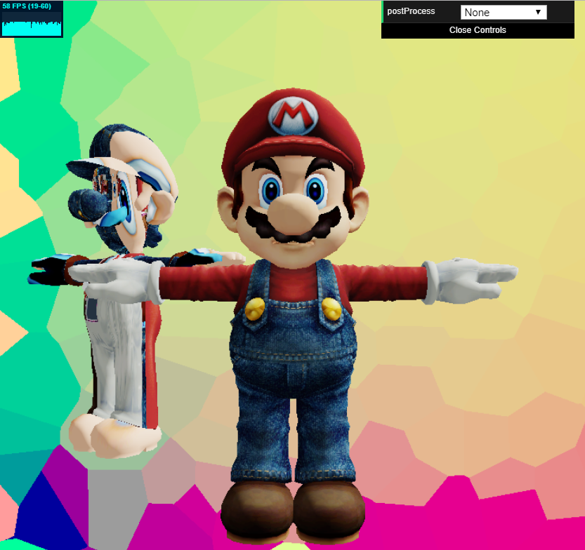
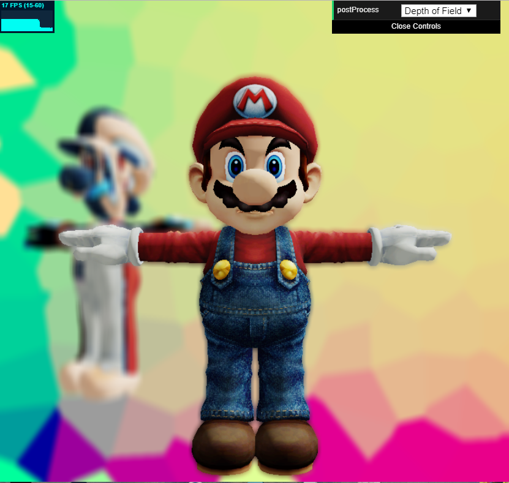
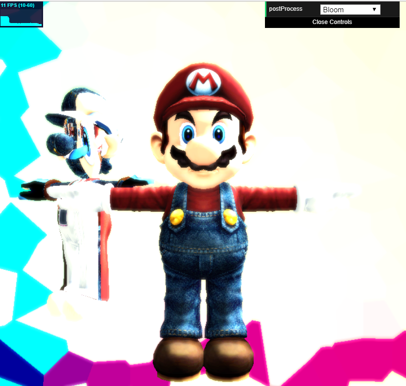
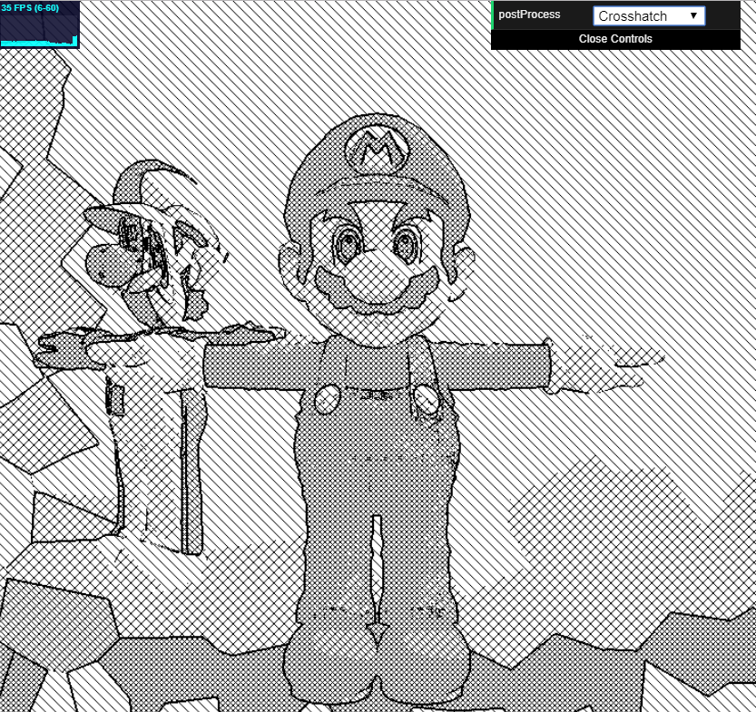

## READ-ME
PennKey: nmaga

Live demo: https://nmagarino.github.io/homework-7-deferred-renderer-nmagarino/

The scene begins with no post process shaders and a worley noise background.  Rendered with a Lambert shader are Wahoo and G̝̻̞͖̝͘r̜̮̞è̫͕͔͔̙e̝̰̖̰̱͍͝n̪̙͈͕̯ ͖̻͇͞W̩̬̤̺̖͠a̸̘͇͍̣̦̰̬h̛̺͕̹͙o͚̰͉̮̠o.

Different post process shaders can be toggled with the drop down menu.  I implemented depth of field, where anything beyond a certain depth is rendered with an applied Gaussian blur.

Then, I tried Bloom, where colors with a high enough luminosity are guassian blurred and added onto the original base pixel color.

Lastly, there is a sort of crosshatched pen-drawn shader.  I did a crosshatch affect based on an implementation from: (https://machinesdontcare.wordpress.com/2011/02/02/glsl-crosshatch/), then I used Sobel edge detection to create the outlines.

